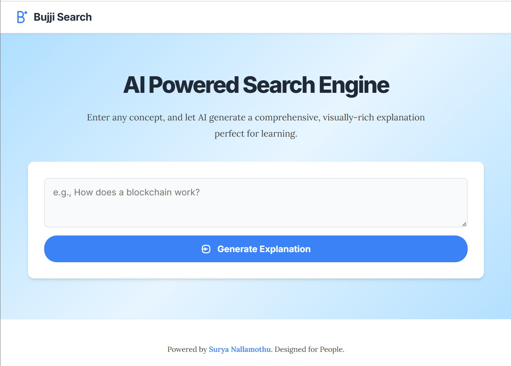

# AI-Powered Search Engine with Gemini and Flask



[Live Demo](https://bujjiaisearch.vercel.app)

---

## 🚀 What is This?

A simple and innovative web app:  
**Type any topic → Get a clear AI explanation with relevant images instantly.**  
Built on Flask, powered by Google's Gemini AI and Bing Image Search.

---

## ✨ Features

- **Instant AI Explanations:** Enter a topic, get a concise, easy-to-read answer.
- **Smart Image Integration:** The app finds and inserts the most relevant images at just the right spots.
- **Modern, Minimal UI:** Clean, distraction-free design—just type and learn.
- **Copy Code Blocks:** One click to copy any code or example shown.
- **Fast Loading:** See results in seconds, with animated feedback.
- **Error Proof:** Friendly error messages if anything goes wrong.
- **Secure API Keys:** Uses .env locally (never hardcoded).
- **Easy Setup:** One command to run locally, or deploy with Vercel.

---

## 🛠️ Tech Stack

- **Python + Flask**
- **Google Gemini AI API**
- **Bing Image Search API**
- **BeautifulSoup4, Requests, Markdown2, Markupsafe**
- **HTML, CSS, JavaScript**
- **python-dotenv**

---

## 💡 How It Works

1. **You enter a topic.**
2. **Gemini AI** writes a simple, clear explanation in Markdown.
3. The app finds `[IMAGE]` placeholders, asks Gemini for image search queries.
4. **Bing Image Search** fetches the best matching images.
5. Everything displays beautifully in your browser—images, text, and code blocks.

---

## ⚡ Quick Start (Local)

1. **Clone & Enter Directory:**
    ```bash
    git clone <repository_url>
    cd <repository_name>
    ```

2. **Add Your API Key:**  
   Create `.env`:
   ```
   GOOGLE_API_KEY=YOUR_API_KEY
   ```

3. **Create & Activate Virtual Env:**
    ```bash
    python -m venv .venv
    source .venv/bin/activate  # or .venv\Scripts\activate on Windows
    ```

4. **Install Requirements:**
    ```bash
    pip install -r requirements.txt
    ```

5. **Run Locally:**
    ```bash
    python app.py
    ```
    Open [http://localhost:5000](http://localhost:5000)

---

## 🌐 Deploy on Vercel

**Vercel makes it easy to deploy Python Flask projects with zero config.**

### Steps:

1. **Push your repository to GitHub.**

2. **Create a `vercel.json` file (in your project root):**
    ```json
    {
      "version": 2,
      "builds": [
        { "src": "app.py", "use": "@vercel/python" }
      ],
      "routes": [
        { "src": "/(.*)", "dest": "app.py" }
      ]
    }
    ```

3. **Add your environment variables in Vercel Dashboard:**
   - Go to your project settings → Environment Variables
   - Add `GOOGLE_API_KEY` and set its value.

4. **Deploy:**
    - Go to [vercel.com](https://vercel.com) and import your GitHub repo.
    - Vercel auto-detects the Python Flask app and deploys it.
    - Your app will be live at `https://<your-app-name>.vercel.app`

**Tip:**  
- You can customize your build settings further in `vercel.json` if needed.
- For static assets (HTML/CSS), include them in your repo and serve with Flask.

---

## 🛡️ Best Practices

- **API Keys:** Always store securely (.env for dev, Vercel Environment Variables for prod)
- **Error Handling:** Friendly messages, never crash
- **Cost:** Cache frequent queries, monitor API usage
- **Content Safety:** Filter/validate AI and images
- **Fast & Simple:** Minimal dependencies, quick response

---

## 🤝 Contribute

Pull requests welcome!  
- Fork, branch, code, test, PR.

---

## ⚖️ License

MIT — use, remix, share!

---

## 🔗 Live Demo

Try now: [https://bujjiaisearch.vercel.app](https://bujjiaisearch.vercel.app)
